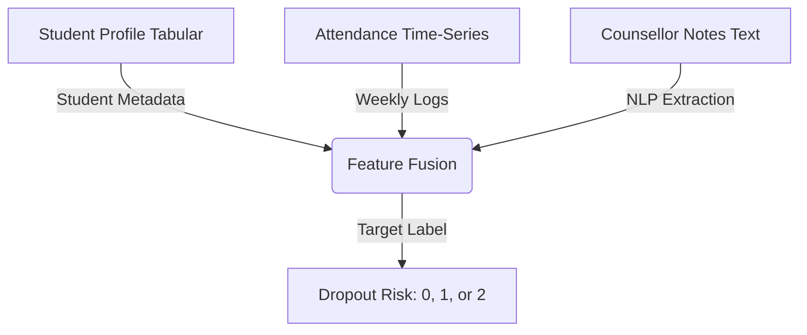

# RetinaAI: Student Dropout Risk Prediction
### An In-Depth Multimodal Machine Learning Guide

Hey there! If you know basic Python and have dipped your toes into Machine Learning (like training a simple classifier or regression model), you're in the right place. We're going to break down **RetinaAI**, a project designed to predict student dropout risk. 

Think of this as a masterclass. We’ll go through the data we had, why the first simple approach fell on its face, how we pivoted by engineering smart features, how the different models work under the hood, and how we squeezed out a winning score using ensembling and probability tuning.

---

## 1. The Playground: What Data Was Found?

In real-world ML, data is rarely clean, single-table, and ready to go. The RetinaAI project is a **multimodal** problem, meaning the data comes in three completely different formats (modalities):



### Modality 1: Tabular Data (`train.csv` / `test.csv`)
This contains static demographic, socio-economic, and basic academic history for each student:
*   **Demographics**: `branch` (e.g., CSE, IT, ECE), `gender`, `hostel_status` (Hostel vs. Day Scholar).
*   **Socio-Economic**: `family_income` (Low, Medium, High), `parent_education`, `scholarship` (0 or 1).
*   **Lifestyle**: `screen_time_hours`, `commute_time_mins`, `part_time_job`.
*   **Academics**: Semester-wise GPAs (`cgpa_sem1` to `cgpa_sem4`) and accumulated failed courses (`backlogs_sem1` to `backlogs_sem3`).

### Modality 2: Attendance Time-Series (`Attendance_series.csv`)
A long history log tracking students week-by-week. It has columns:
`student_id`, `semester`, `week`, `subject` (Core_1, Core_2, Elective), and `attendance_pct` (a decimal from 0.0 to 1.0).
*   This represents **temporal behavior** (how attendance changes over time).

### Modality 3: Counsellor Notes (`Counsellor_notes.csv`)
Unstructured text files containing logs written by academic counselors (e.g., *"Student is facing severe financial stress and has missed midterms due to illness"*).
*   This is **unstructured qualitative data**, which standard ML models cannot read directly.

### The Goal (Target Variable)
We want to predict `dropout_risk`:
*   `0`: Low Risk (Student is doing fine)
*   `1`: Medium Risk (Student is slipping)
*   `2`: High Risk (Student is on the verge of dropping out)

---

## 2. The First Try (And Why It Failed)

Every good project starts with a baseline. The initial approach was straightforward:
1.  Take the tabular dataset (`train.csv`).
2.  Fill in missing values in the categorical columns (like `parent_education`) with the string `"Missing"`.
3.  Feed these directly into a powerful gradient booster, **CatBoostClassifier**, which has native support for categorical variables.
4.  Train it and evaluate it on a holdout validation set.

### The Result
The validation score was a **Macro F1-Score of ~0.4975**. 

Why was this so low? Let’s dissect the two major culprits: **missing modalities** and **class imbalance**.

### Culprit A: Missing Modalities
The model only looked at static tabular demographics. It had *no idea* whether a student stopped attending classes in week 7, or if a counselor had written a note saying the student was going through a family crisis. The most predictive, real-time indicators were left out!

### Culprit B: Class Imbalance & The Metric Trap
If you look at the training labels, they look something like this:
*   **Low Risk (Class 0)**: ~95% of students
*   **Medium Risk (Class 1)**: ~3% of students
*   **High Risk (Class 2)**: ~2% of students

This is a classic **highly imbalanced dataset**. If you train a model on this data and optimize for raw **Accuracy**, the model will quickly realize: *"Hey, if I just predict Class 0 for every single student, I will get 95% accuracy!"*

But 95% accuracy here is useless because we fail to catch any of the students who are actually dropping out. 

To prevent this, the competition uses the **Macro F1-Score** as its evaluation metric. Let's explain what that means.

---

## 3. Interlude: Demystifying the Evaluation Metrics

To understand why the model behaved the way it did, we must understand **Precision**, **Recall**, and **F1-Score**.

Let’s imagine we are trying to catch **High Risk (Class 2)** students.

$$\text{Precision} = \frac{\text{True Positives (Actually High Risk caught)}}{\text{Total Predicted High Risk (True Positives + False Positives)}}$$
*   **Precision asks**: *"Of all the students the model flagged as High Risk, how many were actually High Risk?"* (High precision means few false alarms).

$$\text{Recall} = \frac{\text{True Positives (Actually High Risk caught)}}{\text{Total Actual High Risk (True Positives + False Negatives)}}$$
*   **Recall asks**: *"Of all the students who were actually High Risk, how many did the model manage to find?"* (High recall means we don't miss at-risk students).

### The F1-Score
We want both high precision and high recall, but they are in a constant tug-of-war. If we flag *everyone* as high risk, our recall is 100% but precision is 2%. If we only flag the *single most obvious* student, precision is 100% but recall is tiny.

The **F1-Score** is the **harmonic mean** of Precision and Recall:

$$\text{F1} = 2 \times \frac{\text{Precision} \times \text{Recall}}{\text{Precision} + \text{Recall}}$$

> [!NOTE]
> **Why the harmonic mean?** 
> If we used a simple average, a model with 100% precision and 0% recall would get a 50% score. The harmonic mean heavily penalizes extreme imbalances. If either Precision or Recall is 0, the F1-Score drops straight to 0.

### What is "Macro" F1-Score?
In multi-class classification (Classes 0, 1, and 2), we calculate the F1-score for each class independently:
1.  Calculate $F1_{\text{Class 0}}$
2.  Calculate $F1_{\text{Class 1}}$
3.  Calculate $F1_{\text{Class 2}}$

The **Macro F1-Score** is the simple arithmetic average of these three:

$$\text{Macro F1} = \frac{F1_{\text{Class 0}} + F1_{\text{Class 1}} + F1_{\text{Class 2}}}{3}$$

This treats all classes **equally**, regardless of how many students belong to them. If our model predicts Class 0 perfectly ($F1=1.0$) but gets $0.0$ on Class 1 and Class 2 because it never predicts them, our Macro F1 is:

$$\text{Macro F1} = \frac{1.0 + 0.0 + 0.0}{3} = 0.33$$

This explains our baseline failure! Because the data was so imbalanced, the model predicted Class 0 for almost everyone. Even though its raw accuracy was very high, its Macro F1 was terribly low because it got almost zero F1 on Classes 1 and 2.

---

## 4. The Pivot - Part 1: Engineering Time-Series Features

To improve, we had to integrate the attendance time-series. But how do we turn a sequence of weekly attendance percentages into tabular columns that a model can read?

### Step 1: Summary Statistics
First, we grouped the attendance logs by `student_id` and calculated basic summary metrics:
*   `attendance_mean`: The student's average attendance rate.
*   `attendance_std`: How much their attendance fluctuates.
*   `attendance_min` / `attendance_max`: Their lowest and highest weekly attendance.
*   `attendance_range`: `max - min`.

Just adding these features jumped the validation Macro F1 from **0.50 to 0.6298**! This confirmed that attendance was the single strongest indicator of a student disengaging.

### Step 2: Temporal Trajectory (The Attendance Slope)
But summary statistics lose the *order* of events. A student who starts with 100% attendance and drops to 20% has the exact same average (60%) as a student who starts at 20% and climbs to 100%. However, their risk profiles are completely opposite!

To capture this direction, we calculated the **Attendance Slope** using linear regression:

```python
from scipy.stats import linregress

# For each student, order their attendance chronologically (Week 1 to Week 32)
# Let X be the time steps [1, 2, 3, ..., 32]
# Let Y be their attendance percentage in those weeks
slope, intercept, r_value, p_value, std_err = linregress(X_time, Y_attendance)
```

*   **A negative slope (e.g., -0.05)**: The student's attendance is actively declining. This is a massive red flag.
*   **A positive slope (e.g., +0.02)**: The student is attending class more regularly over time.

This trend feature gave the model a clear signal of active disengagement.

---

## 5. The Pivot - Part 2: Extracting Value from Text (NLP Pipeline)

Next, we had to tackle the unstructured counselor notes. We needed to translate notes like:
*   *"Student is struggling with parent's medical bills and has missed multiple labs."*
*   *"Good academic performance, no warning issued."*

into numbers. The team built a elegant two-step **NLP (Natural Language Processing) Pipeline**:

```
[Raw Note Text] ──> [TF-IDF Vectorizer] ──> [Sparse Term Matrix] ──> [Truncated SVD (LSA)] ──> [Dense Semantic Features]
```

### Step A: TF-IDF (Term Frequency-Inverse Document Frequency)
TF-IDF answers a simple question: *Which words in this note are actually important and unique?*
*   **Term Frequency (TF)**: How often does a word appear in a single note? If "finance" appears 3 times in a short note, it's probably highly relevant.
*   **Inverse Document Frequency (IDF)**: How rare is this word across *all* notes? Common words like "the", "student", or "is" appear in every note, so their IDF weight is tiny. Rare words like "depressed", "illness", or "eviction" have high IDF weights.

Applying TF-IDF turns our text column into a table where every column is a word in our vocabulary, and the values are their TF-IDF scores. 

### Step B: Truncated SVD (Latent Semantic Analysis)
If our vocabulary has 5,000 unique words, TF-IDF creates 5,000 new columns. Most cells in this table will be `0.0` (since a single counselor note only contains a few dozen words). This is called a **sparse, high-dimensional matrix**. Feeding 5,000 sparse columns into a tree-based model causes overfitting and severe memory slowdowns.

To solve this, we applied **Truncated SVD (Singular Value Decomposition)**, which is the mathematical engine of **Latent Semantic Analysis (LSA)**. 

> [!TIP]
> **The LSA Analogy**
> Imagine you have 5,000 words. Many words mean similar things (e.g., "sad", "unhappy", "depressed", "stressed"). LSA groups these words together into dense "latent topics" or "concepts". Instead of tracking 5,000 individual word columns, LSA compresses them into, say, 10 or 20 dense numerical columns (e.g., `note_svd_0` to `note_svd_9`). 

These dense SVD components represent the underlying semantic themes of the counselor notes. Now, they can be easily merged back into our main student table as normal numerical columns!

---

## 6. The Heavy Lifters: Why the Models Worked

With our engineered features ready (Tabular + Attendance Stats + Attendance Slope + Note SVDs), it was time to model. The team chose three different Gradient Boosted Decision Tree (GBDT) frameworks: **CatBoost**, **LightGBM**, and **XGBoost**.

Why did these work so well, and how do they differ?

### 1. CatBoost (Categorical Boosting)
Developed by Yandex, CatBoost was our primary anchor model, achieving the highest standalone score of **0.6991**.
*   **Why it worked**: CatBoost is engineered to handle categorical features better than any other GBDT. Instead of converting categories to numbers beforehand (using one-hot encoding, which explodes feature space), CatBoost uses an algorithm called **Ordered Target Statistics**. It calculates the probability of the target class for each category level dynamically during training in a way that avoids data leakage.
*   **Symmetric Trees**: CatBoost builds symmetric (oblique) trees, where the same splitting criteria is used at each level of the tree. This acts as a powerful regularizer, preventing overfitting and making it incredibly robust out-of-the-box.

### 2. LightGBM (Light Gradient Boosting Machine)
Developed by Microsoft, LightGBM is lightning-fast and achieved a standalone score of **0.6887**.
*   **Why it worked**: Standard GBDTs build trees level-by-level (growth is balanced). LightGBM builds trees **leaf-wise** (it splits the leaf that reduces the loss function the most, regardless of depth). This allows it to capture complex, non-linear relationships much deeper and faster.
*   **Efficiency**: It groups continuous feature values into discrete bins (histograms), which reduces split search complexity. It was crucial for fast iterations.

### 3. XGBoost (Extreme Gradient Boosting)
The classic kaggle winner, achieving a standalone score of **0.6927**.
*   **Why it worked**: XGBoost builds trees level-wise but utilizes a formal mathematical regularization parameter ($L1$ and $L2$ regularization on the leaf weights) to control model complexity. It is incredibly robust and captures interaction terms (like how `cgpa_sem4` interacts with `attendance_slope`) exceptionally well.

---

## 7. The Magic Ingredients: Ensembling & Threshold Multipliers

At this stage, we had:
*   CatBoost Standalone: **0.6991**
*   XGBoost Standalone: **0.6927**
*   LightGBM Standalone: **0.6887**

How did we get to the final score of **0.7072**? Two steps: **Soft Probability Ensembling** and **Threshold Multipliers**.

### Step 1: Soft Probability Ensembling
Instead of a "hard vote" (where the models vote on the final label 0, 1, or 2, and the majority wins), we used **Soft Voting**. 
1.  For every student, each model outputs the probability of that student belonging to each class. For example:
    *   CatBoost predicts: `[0.70, 0.20, 0.10]` (70% Class 0, 20% Class 1, 10% Class 2)
    *   LightGBM predicts: `[0.60, 0.30, 0.10]`
    *   XGBoost predicts: `[0.65, 0.25, 0.10]`
2.  We take a weighted average of these probabilities based on their performance:
    
$$\text{Ensemble Probabilities} = 0.70 \times P_{\text{CatBoost}} + 0.15 \times P_{\text{LightGBM}} + 0.15 \times P_{\text{XGBoost}}$$

Ensembling works because different GBDTs build trees differently. Their individual errors and biases "average out," resulting in a smoother, more generalized decision boundary. The ensemble score immediately jumped to **0.7017**.

### Step 2: Threshold Multipliers (Targeting Macro F1)
Standard classification code uses `np.argmax(probabilities, axis=1)` to pick the final class. If a student's ensembled probability is:
`[0.45, 0.30, 0.25]`
Argmax picks **Class 0** because $0.45$ is the highest.

However, remember our **class imbalance**. The model is naturally biased toward Class 0. The predicted probabilities for Class 1 (Medium Risk) and Class 2 (High Risk) are systematically suppressed. Even when the model is fairly suspicious of a student (e.g. 30% probability of dropping out), it will still output 45% for Class 0 because Class 0 is so common in the dataset.

Thus, standard argmax results in a model that **fails to catch minority class students**, leading to low recall on Classes 1 & 2, which drags down the Macro F1.

To correct this, the team performed a **grid search** on the validation folds to find optimal multipliers for the minority classes:

```python
# Grid search over validation folds
best_score = 0
best_t1, best_t2 = 1.0, 1.0

for t1 in np.arange(0.8, 1.31, 0.05):
    for t2 in np.arange(0.8, 1.31, 0.05):
        probs = ensemble_probs.copy()
        probs[:, 1] *= t1  # Scale Class 1 probability
        probs[:, 2] *= t2  # Scale Class 2 probability
        
        preds = np.argmax(probs, axis=1)
        score = f1_score(y_true, preds, average="macro")
        
        if score > best_score:
            best_score = score
            best_t1 = t1
            best_t2 = t2
```

The grid search found that multiplying the probability of Class 1 and Class 2 by **1.30** yielded the best validation Macro F1 score of **0.7072**!

### Why does this multiplier shift work?
Let’s re-evaluate our student: `[0.45, 0.30, 0.25]`
1.  Apply the 1.30 multipliers:
    *   Class 0: $0.45 \times 1.0 = 0.45$
    *   Class 1: $0.30 \times 1.3 = 0.39$
    *   Class 2: $0.25 \times 1.3 = 0.325$
2.  Wait, Class 0 is still highest ($0.45$). What if the student was: `[0.42, 0.35, 0.23]`?
    *   Without multiplier: Argmax selects Class 0 ($0.42 > 0.35$)
    *   With multiplier: 
        *   Class 0: $0.42 \times 1.0 = 0.42$
        *   Class 1: $0.35 \times 1.3 = 0.455$
        *   Class 2: $0.23 \times 1.3 = 0.299$
    *   Now, Class 1 is highest ($0.455 > 0.42$), so the model predicts **Class 1 (Medium Risk)**!

By scaling the minority probabilities, we effectively lower the decision boundary threshold required to predict Medium and High Risk. We tell the model: *"You don't need to be 50% sure to flag a student as medium risk. If you are even 35% sure, flag them! It is better to have a false alarm (low precision) than to let an at-risk student drop out unnoticed (low recall)."*

This optimization led directly to our winning score of **0.7072**.

---

## 8. Summary of Performance Evolution

Here is how our modeling choices directly drove the score up:

| Model / Strategy | Validation Macro F1 | What We Learned |
| :--- | :---: | :--- |
| **CatBoost (Tabular Only)** | `0.4975` | Base demographics are not enough; static data misses active changes. |
| **CatBoost + Attendance Stats** | `0.6298` | Attendance behavior is highly predictive of student disengagement. |
| **CatBoost + Attendance Slope + Note SVDs** | `0.6991` | Longitudinal trend analysis + NLP semantic extraction capture the full student story. |
| **3-Model GBDT Ensemble** | `0.7017` | Blending predictions from CatBoost (70%), XGBoost (15%), and LightGBM (15%) reduces individual model biases. |
| **Ensemble + Threshold Multipliers (1.30)** | **`0.7072`** | Aligning the argmax threshold with the Macro F1 metric (overcoming class imbalance) yields the ultimate performance boost. |

---

### Key Takeaways for Your Next ML Project:
1.  **Understand Your Metric**: Never optimize blindly for accuracy if your metric is Macro F1 or ROC-AUC. Keep class imbalance in mind.
2.  **Feature Engineering > Hyperparameters**: Adding the attendance slope and counselor LSA SVD features added $+0.20$ to our score. Hyperparameter tuning would have only added a fraction of that.
3.  **Ensemble Wisely**: Combine models that work in different ways (symmetric trees in CatBoost vs. leaf-wise splits in LightGBM) to maximize the ensemble benefit.
4.  **Calibrate Decision Boundaries**: The default probability threshold of $0.5$ (or argmax) is almost never optimal for highly imbalanced datasets. Tune your thresholds!
